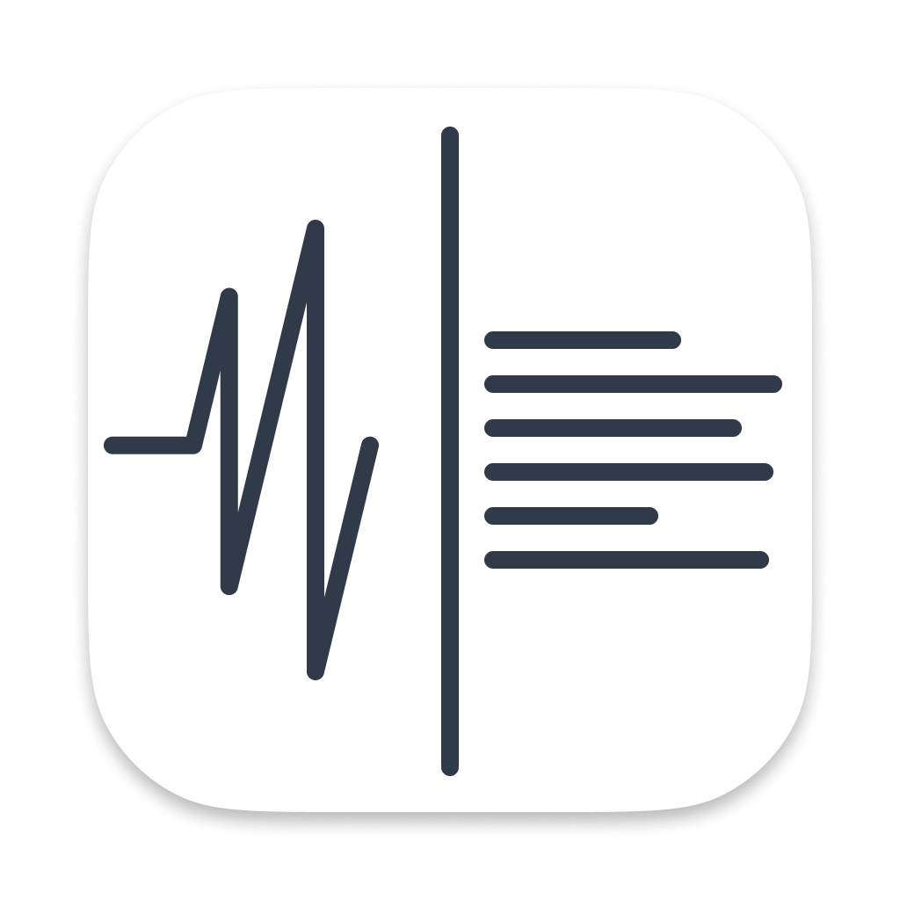

  <picture>
     
  </picture>

# Whispr

Create a transcription from the mic, system, or application's sound.

## References

- [Meet ScreenCaptureKit](https://youtu.be/UvR0PNeEXcI)
- [Take ScreenCaptureKit to the next level](https://youtu.be/PcqfIFYnVBI)
- [What’s new in ScreenCaptureKit](https://youtu.be/-kM0inzL6uM)
- [Capturing screen content in macOS](https://developer.apple.com/documentation/screencapturekit/capturing-screen-content-in-macos)
- [Capturing stereo audio from built-In microphones](https://developer.apple.com/documentation/avfaudio/capturing-stereo-audio-from-built-in-microphones)
- [AVCaptureAudioDataOutput](https://developer.apple.com/documentation/avfoundation/avcaptureaudiodataoutput)
- [Capturing system audio with Core Audio taps](https://developer.apple.com/documentation/coreaudio/capturing-system-audio-with-core-audio-taps)
- [insidegui/AudioCap](https://github.com/insidegui/AudioCap)
